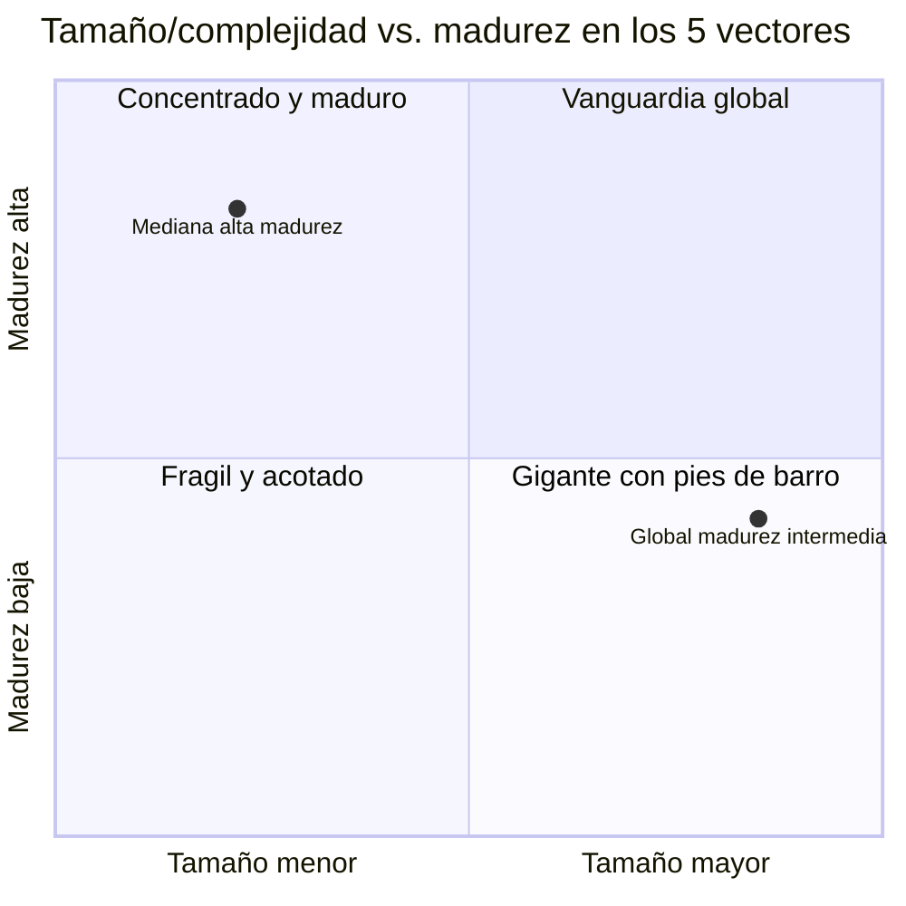
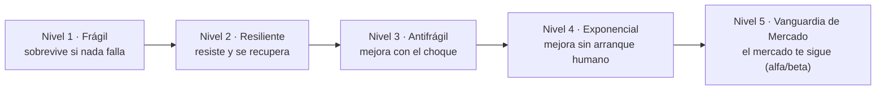

# Framework de Maduración 5C: De Frágil a Vanguardia de Mercado

*Modelo híbrido (humano + agente) para diagnóstico y roadmap de madurez en procesos, personas y productos, construido sobre los cinco vectores documentados en Vectores-5C-IT-Estrategia: Comunicación, Confianza, Cooperación, Colaboración y Complementariedad.*

## Resumen ejecutivo

Este framework toma la estructura de niveles de CMMI/ISO y la lógica de Taleb sobre fragilidad-antifragilidad, y las aplica a los 5 vectores. Define 5 niveles de maduración (Frágil → Resiliente → Antifrágil → Exponencial → Vanguardia de Mercado), una matriz que cruza cada vector con cada nivel, y un protocolo de diagnóstico ligero pensado para ser ejecutado tanto por un consultor humano como por un agente de IA en fases de Research y Diagnóstico. No es una certificación ni un estándar auditable: es una herramienta de diagnóstico y priorización para construir roadmaps.

## 1. Para qué sirve y cómo usarlo

- **Audiencia:** estrategas, CIOs y consultores que necesitan diagnosticar madurez organizacional y priorizar intervenciones — no un manual de implementación paso a paso.
- **Uso híbrido:** cada componente (preguntas diagnósticas, matriz, esquema de puntuación) produce un veredicto corto y verificable. Un agente puede completarlo con evidencia (documentos, métricas, transcripciones); un humano lo valida o lo matiza.
- **Fases de uso:** Research (recolección de evidencia) y Diagnóstico (ubicación en el modelo). El diseño del roadmap se apoya en el diagnóstico; la ejecución queda fuera del alcance de este documento.

## 2. Punto de partida: los 5 vectores y su orden causal

El documento fuente no presenta los 5 vectores como una lista plana: identifica dependencias entre ellos. Este framework respeta ese orden en vez de usar orden alfabético:

| Orden | Vector | Rol en el sistema |
|---|---|---|
| 1 | **Comunicación** | Activa la confianza; sin diálogo estructurado no hay confianza que gobernar. |
| 2 | **Confianza** | Infraestructura invisible; permite pasar de control a autonomía. |
| 3 | **Cooperación** | Piso mínimo: compartir información sin fricción. Necesaria pero no suficiente. |
| 4 | **Colaboración** | El salto sobre la cooperación: objetivos, recursos y calendario alineados. |
| 5 | **Complementariedad** | Lógica económica: amplifica el valor de los 4 vectores anteriores combinados con capacidades no-IT. |

Dato clave del documento fuente: cooperación y colaboración no son sinónimos ni el mismo nivel de madurez — cooperación es la base, colaboración es el salto. Este framework generaliza esa misma lógica a los 5 vectores: no maduran de forma pareja, y el orden importa.

## 3. Principio rector: la madurez no es proporcional al tamaño

Es común asumir "más grande = más maduro" o "más chico = menos capaz". Este framework trata **tamaño/complejidad** y **madurez en los 5 vectores** como ejes independientes. Una mediana puede tener madurez alta en los 5 vectores (fue diseñada con menos capas que desalinear); una global puede tener madurez apenas intermedia (la escala multiplica los costos de coordinación más rápido de lo que la organización madura).



**Implicación práctica:** el benchmark correcto no es "organizaciones de mi tamaño", sino "organizaciones en mi mismo nivel de madurez, sin importar tamaño". Comparar una global contra otra global puede ocultar que ambas están, en realidad, en Nivel 2.

## 4. Las cinco etapas de maduración

### Nivel 1 · Frágil
**Qué significa:** el sistema funciona solo si nada falla. Depende de personas específicas, no de diseño.
**Procesos — Personas — Productos:** ad hoc, se reinventan cada vez — conocimiento concentrado en 1-2 personas, roles difusos — reactivos, definidos por la última solicitud, sin visión de portafolio.
**Pregunta diagnóstica:** *si la persona que sabe esto renuncia mañana, ¿el proceso colapsa?* Si sí, está aquí.

### Nivel 2 · Resiliente
**Qué significa:** el sistema resiste el choque y se recupera al mismo estado anterior, pero no aprende de él.
**Procesos — Personas — Productos:** documentados, con SLA y plan de contingencia — roles y backups formales, cooperación es norma — estables y con control de calidad, pero el roadmap sigue viniendo de arriba hacia abajo.
**Pregunta diagnóstica:** *tras el incidente, ¿todo vuelve exactamente a como estaba, ni mejor ni peor?* Si sí, está aquí.

### Nivel 3 · Antifrágil
**Qué significa:** el error y el estrés se convierten en insumo; el sistema sale mejor que antes de cada choque.
**Procesos — Personas — Productos:** postmortems sin culpa, experimentación controlada institucionalizada — autonomía con límites claros, aprendizaje continuo es parte del rol — se iteran según señal real de mercado, portafolio de apuestas pequeñas.
**Pregunta diagnóstica:** *después de la crisis, ¿algo quedó objetivamente mejor de lo que estaba antes de que ocurriera?* Si sí, está aquí.

### Nivel 4 · Exponencial
**Qué significa:** la mejora deja de depender linealmente de esfuerzo humano constante; datos y agentes co-gestionan la optimización.
**Procesos — Personas — Productos:** se auto-ajustan con datos/agentes, el humano supervisa por excepción — el rol migra de ejecutar a diseñar y calibrar sistemas — casi se personalizan en tiempo real, el ciclo señal-cliente → cambio-producto se mide en días.
**Pregunta diagnóstica:** *¿la mejora ocurre sin que un humano tenga que iniciarla cada vez?* Si sí, está aquí.

### Nivel 5 · Vanguardia de Mercado (Alfa/Beta)
**Qué significa:** la organización deja de adaptarse al mercado — lo define. Sus prácticas se vuelven el terreno de prueba (beta) que el sector adopta como estándar, y esa posición genera ventaja difícil de replicar (alfa).
**Procesos — Personas — Productos:** se convierten en benchmark que otros licencian o copian — la organización es imán de talento — crean categoría, no compiten dentro de una existente.
**Pregunta diagnóstica:** *¿la competencia te copia a ti, o tú sigues copiando a la competencia?* Si te copian a ti, está aquí.



## 5. Matriz de maduración: los 5 vectores en las 5 etapas

| Vector | 1 · Frágil | 2 · Resiliente | 3 · Antifrágil | 4 · Exponencial | 5 · Vanguardia |
|---|---|---|---|---|---|
| **Comunicación** | Informal, depende de personas clave, sin cascada business-IT | Diálogo estructurado y periódico, documentado | Retroalimentación bidireccional en tiempo real; el fallo corrige el protocolo | Resúmenes/alertas generados por agentes; el canal se auto-ajusta | El modelo de diálogo business-IT es benchmark de industria |
| **Confianza** | Personal/informal, control estrecho por defecto | Reglas explícitas de límites y rendición de cuentas | Se extiende bajo estrés: el error amplía autonomía en vez de reducirla | Calibrada también hacia agentes de IA, con límites auditables | Su estándar de confianza es referencia de industria o regulación |
| **Cooperación** | Información compartida de forma inconsistente | Compartir roadmaps es norma explícita, con SLA básico | Se activa automáticamente ante señales de riesgo | Mediada por agentes que sincronizan estado sin fricción humana | El ecosistema externo coopera porque su estándar reduce costos de todos |
| **Colaboración** | Esporádica, confundida con herramientas o reuniones | Contrato de colaboración explícito por proyecto mayor | Se intensifica ante la incertidumbre; se institucionaliza | Humano-agente nativa: agentes como miembros del squad | Su modelo de colaboración es case study que otros adoptan |
| **Complementariedad** | Se compra tecnología sin capacidad interna de absorción | Auditoría explícita de complementariedad antes de adquirir | Los choques de mercado revelan combinaciones no previstas | Orquestada por plataforma/datos; efectos de red sin intervención manual | Su arquitectura de complementariedad es IP difícil de replicar — ahí nace el alfa |

## 6. Cómo leer la matriz: la lógica del cuello de botella

La lectura no es fila por fila ni un promedio de las 5. Sigue teoría de restricciones: el nivel real del sistema lo determina el vector más débil.

**Nivel del sistema = MIN(Comunicación, Confianza, Cooperación, Colaboración, Complementariedad)**

Una organización con Complementariedad en Nivel 4 y Confianza en Nivel 1 no está en 2.5 — está en Nivel 1, porque la falta de confianza limita cuánta autonomía y velocidad puede sostener cualquier otro vector. Regla de priorización: la siguiente intervención va sobre el vector más bajo, no sobre el más fácil de mejorar.

## 7. Lo que cambia — y lo que hay que soltar — en cada salto

| Transición | Naturaleza del cambio | Qué hay que soltar | Qué hay que construir |
|---|---|---|---|
| Frágil → Resiliente | Ingeniería y disciplina | Dependencia de héroes individuales | Documentación, redundancia, SLAs |
| Resiliente → Antifrágil | Cambio cultural y de liderazgo | Control como respuesta por defecto al error | Tolerancia al error visible, postmortems sin culpa |
| Antifrágil → Exponencial | Capacidad tecnológica y de datos | La idea de que la mejora la inicia un humano cada vez | Plataformas, datos limpios, agentes con supervisión por excepción |
| Exponencial → Vanguardia | Posición estratégica y timing de mercado | La idea de que basta con ejecutar mejor que el estándar | Una apuesta de categoría — y que el mercado esté listo para seguirla |

Los dos primeros saltos se pueden comprar (consultoría, herramientas, procesos). Los dos últimos se cultivan: dependen de cambio cultural y de que el entorno esté listo para acompañar el salto.

## 8. El salto final: qué significa "Alfa/Beta de mercado"

**Beta de mercado:** la organización opera a una escala o disciplina tal que se convierte, sin buscarlo activamente, en el terreno de prueba de lo que el resto del sector adoptará después como estándar — la práctica se valida en producción antes de que exista una norma al respecto.

**Alfa de mercado:** en el sentido financiero — retorno por encima del mercado —, la organización captura ventaja que no proviene de un activo copiable (tecnología, capital) sino de la combinación única y madura de los 5 vectores, difícil de replicar porque exige años de maduración simultánea, no una sola adquisición.

Llegar aquí no depende solo de la organización: requiere las 3 transiciones anteriores resueltas Y que el entorno esté en un punto donde seguir ese estándar sea deseable. Es la única transición del modelo que no se puede forzar completamente desde adentro.

## 9. Protocolo de diagnóstico rápido (uso híbrido humano + agente)

1. **Recolectar evidencia por vector** — usar las métricas ya sugeridas en el documento fuente: % proyectos cross-funcionales, índice de confianza digital, tiempo de entrega de diseño integrado, número de productos nuevos por combinación de capacidades, frecuencia de diálogos business-IT.
2. **Puntuar cada vector 1-5** con la pregunta diagnóstica de la Sección 4 como filtro — un veredicto por nivel, no una encuesta de percepción.
3. **Ubicar la organización en el eje de tamaño/complejidad** (Sección 3) — para calibrar expectativas de costo de coordinación, no para comparar contra pares del mismo tamaño.
4. **Identificar el vector cuello de botella** (Sección 6) — el de puntuación más baja define el nivel real del sistema.

Un agente puede ejecutar los pasos 1-2 si tiene acceso a documentos, transcripciones o métricas ya recolectadas, dejando los pasos 3-4 para validación humana. Esquema mínimo de salida:

```json
{
  "organizacion": "",
  "tamano_complejidad": 0.0,
  "vectores": {
    "comunicacion":      { "nivel": 0, "evidencia": "" },
    "confianza":         { "nivel": 0, "evidencia": "" },
    "cooperacion":       { "nivel": 0, "evidencia": "" },
    "colaboracion":      { "nivel": 0, "evidencia": "" },
    "complementariedad": { "nivel": 0, "evidencia": "" }
  },
  "vector_cuello_de_botella": "",
  "nivel_del_sistema": 0,
  "siguiente_salto_recomendado": ""
}
```
*(nivel: 1-5 según Sección 4; tamano_complejidad: 0 = pequeña, 1 = global)*

## 10. De diagnóstico a roadmap

- **Una intervención a la vez, dirigida al cuello de botella** — no repartir presupuesto entre los 5 vectores por igual.
- **Dimensionar el esfuerzo según la naturaleza del salto** (Sección 7) — 1→2 y 2→3 se planean como proyecto; 3→4 y 4→5 se planean como apuesta con hitos de aprendizaje, no con fecha de entrega fija.
- **Revalidar el diagnóstico cada 2-3 trimestres** — un vector puede retroceder (rotación de liderazgo, fusión, crisis) antes de que el resto del sistema lo haga visible.
- **Usar la matriz como lenguaje común** entre negocio e IT — la Sección 5 se traduce directo en agenda de comité: qué vector, qué nivel, qué evidencia.

## 11. Límites del modelo

- No es una certificación ni un estándar auditable como ISO; es una herramienta de diagnóstico y priorización.
- Los umbrales entre niveles son deliberadamente cualitativos — se ajustan al contexto regulatorio e industria de cada organización.
- El Nivel 5 no es un estado permanente: el mercado eventualmente alcanza a quien lo definió, y el ciclo vuelve a empezar en otro vector.
